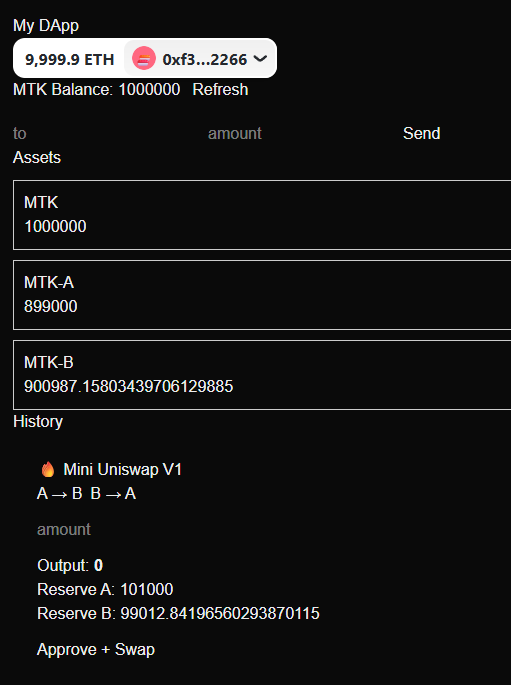

This is a [Next.js](https://nextjs.org) project bootstrapped with [`create-next-app`](https://nextjs.org/docs/app/api-reference/cli/create-next-app).

## Getting Started

First, run the development server:

```bash
npm run dev
# or
yarn dev
# or
pnpm dev
# or
bun dev
```

Open [http://localhost:3000](http://localhost:3000) with your browser to see the result.

You can start editing the page by modifying `app/page.tsx`. The page auto-updates as you edit the file.

This project uses [`next/font`](https://nextjs.org/docs/app/building-your-application/optimizing/fonts) to automatically optimize and load [Geist](https://vercel.com/font), a new font family for Vercel.

## Learn More

To learn more about Next.js, take a look at the following resources:

- [Next.js Documentation](https://nextjs.org/docs) - learn about Next.js features and API.
- [Learn Next.js](https://nextjs.org/learn) - an interactive Next.js tutorial.

You can check out [the Next.js GitHub repository](https://github.com/vercel/next.js) - your feedback and contributions are welcome!

## Deploy on Vercel

The easiest way to deploy your Next.js app is to use the [Vercel Platform](https://vercel.com/new?utm_medium=default-template&filter=next.js&utm_source=create-next-app&utm_campaign=create-next-app-readme) from the creators of Next.js.

Check out our [Next.js deployment documentation](https://nextjs.org/docs/app/building-your-application/deploying) for more details.

# Frontend (Next.js + wagmi + RainbowKit)

This is the frontend of the Ethereum DApp, built with a modern Web3 stack:

* Next.js (App Router)
* wagmi (React hooks for Ethereum)
* viem (low-level RPC client)
* RainbowKit (wallet connection UI)

---

## ✨ Features

* Connect wallet (MetaMask, WalletConnect, etc.)
* Read on-chain data (ERC20 balance)
* Write transactions (mint token)
* Listen to smart contract events (Minted)

---

## 📁 Project Structure

```
frontend/
├── src/
│   ├── app/              # Next.js App Router pages
│   ├── abi/              # Contract ABI (copied from foundry)
│   ├── lib/              # wagmi config
│   ├── components/       # UI components (Balance, MintButton, etc.)
│   └── constants.ts      # Contract addresses
│
├── public/
├── package.json
└── README.md
```

---

## 🚀 Getting Started

### 1. Install dependencies

```bash
npm install
```

---

### 2. Run development server

```bash
npm run dev
```

Open:

```
http://localhost:3000
```

---

## 🔗 Connect to Smart Contract

### Contract Address

Edit:

```
src/constants.ts
```

```ts
export const TOKEN_ADDRESS = '0xYourContractAddress'
```

---

### ABI

Make sure ABI is copied from the Foundry project:

```
foundry/out/MyToken.sol/MyToken.json
```

→ copy to:

```
frontend/src/abi/MyToken.json
```

---

## 🧠 Core Concepts

### Wallet Connection

Handled by RainbowKit:

```tsx
<ConnectButton />
```

---

### Read Contract (balance)

```ts
useReadContract({
  address: TOKEN_ADDRESS,
  abi,
  functionName: 'balanceOf',
  args: [address],
})
```

---

### Write Contract (mint)

```ts
useWriteContract({
  address: TOKEN_ADDRESS,
  abi,
  functionName: 'mint',
  args: [address, BigInt(1e18)],
})
```

---

### Event Listening

```ts
useWatchContractEvent({
  eventName: 'Minted',
  onLogs(logs) {
    console.log(logs)
  },
})
```

---

## ⚙️ Configuration

### Network

Currently using:

* Sepolia Testnet

Configured in:

```
src/lib/wagmi.ts
```

---

### WalletConnect

You need a `projectId` from WalletConnect:

```
https://cloud.walletconnect.com/
```

---

## ⚠️ Notes

* Make sure MetaMask is connected to Sepolia
* Ensure your wallet has test ETH
* ABI must match deployed contract
* Use `BigInt` for token amounts (not number)

---

## 🔒 Security Reminder

* Never expose private keys in frontend
* All transactions must be signed by the user wallet

---

## 🧩 Future Improvements

* Transaction status UI (pending / success / error)
* Token transfer UI
* Event history display
* Better state management
* UI framework (Tailwind / Shadcn)

---

## 🧱 Related

* Smart Contracts → `../foundry/`
* Shared ABI → `../shared/`

---

## 📌 Goal

This frontend is designed to:

> Bridge smart contracts and users, turning on-chain logic into a usable product.

